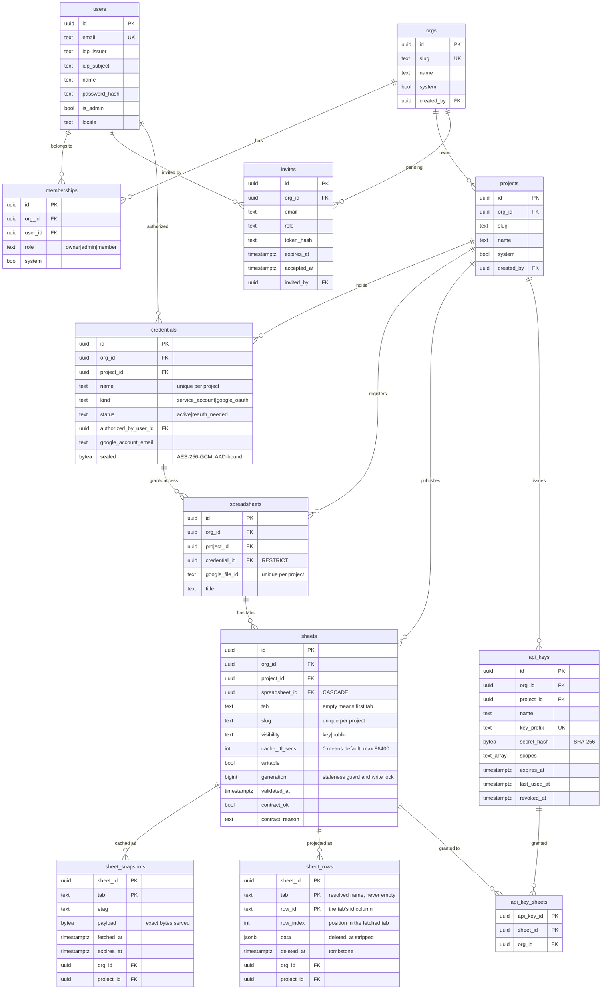

# schema

Embedded goose migrations for Postgres and SQLite, the runtime migrator, the
RLS boot-time guard, and the tenant-table registry consumed by `tenant.PgConn`.

Migrations are `.sql` templates rendered with `{{.Schema}}`, `{{.TablePrefix}}`
and `{{.RLSEnforce}}` before goose applies them. Both dialects satisfy the same
domain interfaces — SQLite is dev/demo, Postgres is production.

## Layout

```
schema/
├── migrations/postgres/    # 001_init … 005_definer_functions (template),
│                           # 006_opensheet, 007_row_projection (this
│                           # project), VERSION
├── migrations/sqlite/      # 001_init … 003_todo_stale_idx (template),
│                           # 004_opensheet, 005_row_projection (this
│                           # project), VERSION
├── migrator.go             # goose runner, template rendering, embed FS
├── migrator_templatefs.go  # per-boot template-rendered file system
├── rls_guard.go            # boot-time BYPASSRLS rejection + pg_policies audit
└── tenant_tables_gen.go    # generated from RLS migrations (make tenant-tables)
```

`TenantTableSuffixes` (in `tenant_tables_gen.go`) drives RLS enforcement —
every table in that list carries `org_id` and gets `FORCE ROW LEVEL SECURITY`
on Postgres. Regenerate with `make tenant-tables` after adding a tenant-scoped
table; the generator derives the list from the RLS migrations, so a table with
no policy silently will not appear.

## Template variables

Exactly three, defined by `templateVars` in `migrator_templatefs.go`:

| Variable           | Meaning                                                                 |
| ------------------ | ----------------------------------------------------------------------- |
| `{{.Schema}}`      | schema holding the app's tables (`db.schema`)                           |
| `{{.TablePrefix}}` | prepended to every table, index, policy and function (`db.tablePrefix`) |
| `{{.RLSEnforce}}`  | `tenant.rlsEnforce` — wraps the whole body of an RLS migration          |

`{{.RLSEnforce}}` is `tenant.rlsEnforce`
(`OPENSHEET_TENANT_RLS_ENFORCE`, default `true`), read by `migrator.go` as
`cfg.Tenant.RLSEnforce`. It is **not** derived from `db.allowBypassRLS` — the
two are independent keys, so setting `db.allowBypassRLS` changes nothing about
what a migration renders. To render a schema without policies, set
`OPENSHEET_TENANT_RLS_ENFORCE=false`.

There is **no `Role` variable.** Migrations do not `SET ROLE`; the migrator
_connection_ does. `boot.MigratorDBConfig` sets `DBConfig.Role` from
`db.migrator.role` and `internal/platform/db/db.go:97-109` issues one
`SET ROLE` on that session, optionally over a separate `db.migrator.dsn`. A
`{{.Role}}` reference in SQL is not an error — Go templates render a missing map
key as the zero value — so `{{if .Role}}` is silently always false and any DDL
inside it would run as the app role. Do not write one.

## Tables



`users` is global (no `org_id`); every other table is tenant-scoped and appears
in `TenantTableSuffixes`. `api_key_sheets` carries `org_id` despite being a join
table for exactly that reason — a join table still needs its own policy.

An **empty `api_key_sheets` set means "every sheet in the key's project"**, not
"no sheets". That default is why `apikey.ByPrefix` reads the grant inside a
transaction scoped to the key's own org rather than defaulting it — see below.

`sheet_snapshots.payload` is `bytea`, not `jsonb`, because `etag` is a hash of
those exact bytes and `jsonb` would reorder keys and normalise numbers.

`sheet_rows` is the queryable projection of a published tab, keyed on the tab's
`id` column. `row_index` is the row's position among the tab's data rows, so an
interior blank row consumes an index rather than compacting the ones below it;
the spreadsheet row is `row_index + 2`. `sheets.generation` guards it: a refresh
captures the counter before fetching and its write is discarded if the counter
moved, and a `PATCH` takes the same counter as a per-sheet write lock.
`sheet_rows.data` is `jsonb`, so its keys come back in Postgres' own order — the
served body is rebuilt with `encoding/json`, never read out of `jsonb` ordering.

## SECURITY DEFINER wrappers

Some lookups run before any tenant scope exists, so they cannot pass through
RLS. Each is a `SECURITY DEFINER` function owned by the migrator role, with
`SET search_path` pinned and `EXECUTE` revoked from `PUBLIC`:

| Function                         | Migration    | Consulted before scope exists to…   |
| -------------------------------- | ------------ | ----------------------------------- |
| `list_org_ids`                   | `005`, `006` | enumerate tenants for the scheduler |
| `resolve_org_by_slug`            | `005`        | turn a URL slug into an org         |
| `list_orgs_for_user`             | `005`, `006` | list a user's orgs at login         |
| `resolve_invite_by_token_hash`   | `005`        | redeem an invite                    |
| `list_pending_invites_for_email` | `005`, `006` | find an invite during signup        |
| `apikey_by_prefix`               | `006`        | resolve a presented API key's org   |

`006` refines four of these: `CREATE OR REPLACE` adds an ordering tiebreak to
`list_orgs_for_user` and `list_pending_invites_for_email`, `DROP` then `CREATE`
widens `list_org_ids` to `RETURNS TABLE (id uuid, created_at timestamptz)`
(Postgres refuses `CREATE OR REPLACE` across a return-type change), and
`apikey_by_prefix` is added outright.

SECURITY: **`current_org_id` (`002`) is not one of these.** It is plain
`LANGUAGE sql STABLE` with no `SECURITY DEFINER` and no `REVOKE`, and all 13
RLS policies call it in `USING`, evaluated as the _querying_ role. Revoking
`EXECUTE` on it breaks every tenant-scoped read, and only under
`db.allowBypassRLS=false` — so it passes every dev run. Do not add it to the
list above and do not redefine it.

SECURITY: `apikey_by_prefix` returns `SETOF api_keys` — the key row only. It
deliberately does **not** join `api_key_sheets`, which has its own RLS policy.
A pre-scope join there returns zero grant rows, and an empty grant means "every
sheet in the project", so a key restricted to one sheet would authenticate as
unrestricted. `ByPrefix` therefore resolves the key without RLS and then reads
the grant inside a `BeginTenanted` transaction on that key's own org. Do not
collapse it into one query.

## Adding a migration

1. Add `NNN_<name>.sql` under both `migrations/postgres/` and
   `migrations/sqlite/`, with goose `-- +goose Up` / `-- +goose Down` and
   `-- +goose StatementBegin` / `StatementEnd` markers. The next Postgres
   migration is `008`; the next SQLite one is `006`.
2. **Bump `VERSION`** in the affected dialect to the highest `NNN` present.
   `migrator.go` reads it as goose's target, so a file beyond the pin is
   **silently ignored** — no error, just an absent table.
3. Write identifiers **unquoted**: `{{.Schema}}.{{.TablePrefix}}widgets`. Plain
   `CREATE TABLE` — no existing migration uses `IF NOT EXISTS`, goose's version
   table already makes it redundant.
4. If the table carries `org_id`, add its policy to the Postgres RLS migration
   and run `make tenant-tables`. Policies use `USING (...)` only, call the
   `current_org_id()` helper, and never inline
   `current_setting('app.current_org_id', ...)` —
   `tenant_policy_guard_test.go` counts inlined uses and fails the build.
   Wrap the whole body in `{{if .RLSEnforce}} … {{end}}`, and pair
   `ENABLE ROW LEVEL SECURITY` with `FORCE ROW LEVEL SECURITY`.
5. Migrations are append-only history. Never edit or delete one that a deployed
   instance has already applied — correct it with a new migration instead.

### The template boundary

Postgres `001`–`005` and SQLite `001`–`003` came from the altalune template.
They are **never edited, renamed, renumbered or deleted** — keeping them intact
is what lets this fork stay diffable against the template it came from, the
same reason `authl/`, `logger/`, `nanoid/` and `internal/platform/` signatures
are copied verbatim.

A fix we need to a template-owned object therefore goes into a migration **we**
own, placed as early in our sequence as possible — today `006_opensheet.sql`,
the first migration we own — never by editing the template file. Inside that
file, refinements to inherited objects come before opensheet's own tables. If
the `invites` table or one of its functions needs changing, that change is a
new migration of ours, not an edit to `002` or `005`.

## Verifying

```bash
go test ./schema/...                                  # template + guard tests
go test -tags=integration ./schema/...                # against real Postgres
opensheet migrate up                                  # NOT `migrate`, which only prints help
make tenant-tables                                    # regenerate the registry
```

The integration suite is the only thing that proves a policy actually works:
`TestAuditPolicies_AcceptsMigratedHelperScopedPolicies` runs `AuditPolicies`
over every `TenantTableNames` entry against a freshly migrated schema. A test
connecting as a superuser proves nothing about RLS, so the fixtures bind the
store to a `NOBYPASSRLS` role and assert `rolbypassrls = false` first.
